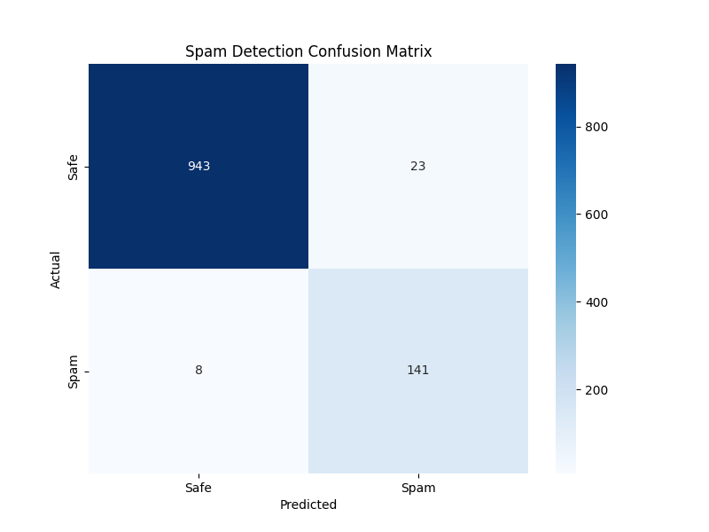

# 💌 Professional Spam Email Detection System

A production-grade machine learning application that classifies emails as **Spam** or **Safe (Ham)** using Natural Language Processing (NLP) and the Multinomial Naive Bayes algorithm.

## 🚀 Key Features for Recruiters
- **Modular Architecture:** Clean separation of concerns with `utils.py`, `train_model.py`, and `app.py`.
- **Advanced Metrics:** Beyond simple accuracy; uses Precision, Recall, and F1-Scores.
- **Exploratory Data Analysis (EDA):** Automated Word Cloud generation to understand data distribution.
- **Production Readiness:** Implemented professional **Logging** and **Model Persistence** (serialization).
- **Confidence Scoring:** The UI displays the model's confidence percentage for every prediction.

## 📊 Visualizations
### Word Clouds (Exploratory Data Analysis)
| Spam Messages | Safe Messages |
| :---: | :---: |
|  |  |

### Model Performance
The model achieves high accuracy by identifying key linguistic patterns.


## 📁 Project Structure
- `app.py`: The Graphical User Interface (Tkinter) for real-time predictions.
- `train_model.py`: Script to train the model and generate performance metrics/plots.
- `visualize.py`: Generates Word Clouds for data visualization.
- `utils.py`: Contains shared utility functions (text cleaning) and logging configuration.
- `spam.csv`: The raw dataset used for training.
- `requirements.txt`: List of dependencies for easy environment setup.

## 🛠️ Installation & Usage

1. **Clone & Setup:**
   ```bash
   pip install -r requirements.txt
   ```

2. **Train & Visualize (Optional):**
   This generates the `.pkl` files and all performance graphs.
   ```bash
   python train_model.py
   python visualize.py
   ```

3. **Run the App:**
   ```bash
   python app.py
   ```

## 🧠 Technical Deep Dive
- **Vectorization:** `CountVectorizer` with English stop-word filtering.
- **Classifier:** `MultinomialNB` – chosen for its efficiency and strong performance on high-dimensional text data.
- **Pre-processing:** Regex-based cleaning, lowercasing, and punctuation stripping.
